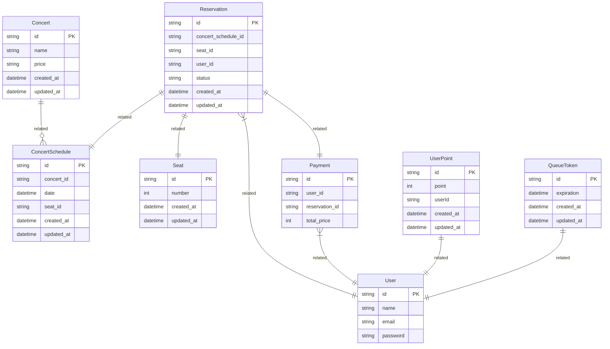

```mermaid
erDiagram
    Concert ||--o{ ConcertSchedule : related
    Reservation ||--|| Seat : related
    Reservation ||--|| ConcertSchedule : related
    Reservation ||--|| Payment : related
    Reservation }|--|| User : related
    Payment }|--|| User : related 
    UserPoint ||--|| User : related
    QueueToken ||--|| User : related
    
    Concert {
        string id PK
        string name
        string price
	      datetime created_at
	      datetime updated_at
    }
    ConcertSchedule {
        string id PK
        string concert_id
        datetime date
        string seat_id
   	    datetime created_at
	      datetime updated_at
    }
    Seat {
		    string id PK
		    int number
	      datetime created_at
	      datetime updated_at 
    }
    Reservation {
		    string id PK
		    string concert_schedule_id
		    string seat_id
		    string user_id  
		    string status
	      datetime created_at
	      datetime updated_at
    }
    Payment {
		    string id PK
		    string user_id 
		    string reservation_id
		    int total_price
    }
    User {
		    string id PK
		    string name 
		    string email 
		    string password
    }
    UserPoint {
		    string id PK
		    int point
		    string userId
			  datetime created_at
	      datetime updated_at
    }
    QueueToken {
		    string id PK
		    datetime expiration 
		    datetime created_at
	      datetime updated_at
    }
```