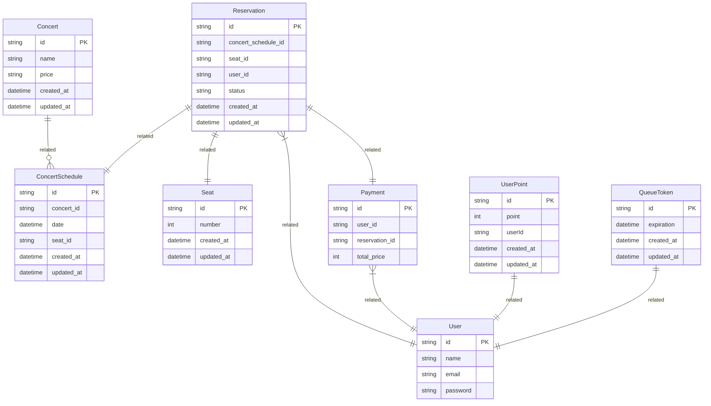
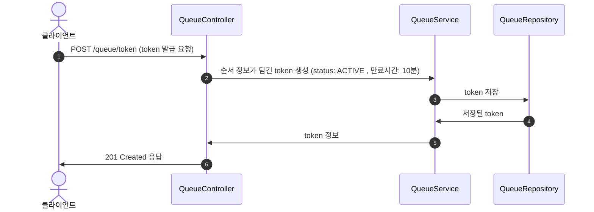
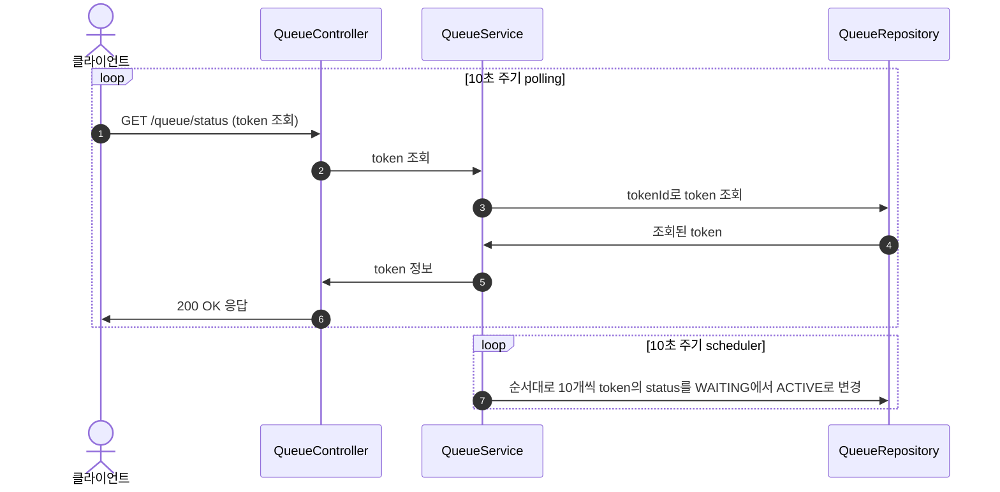
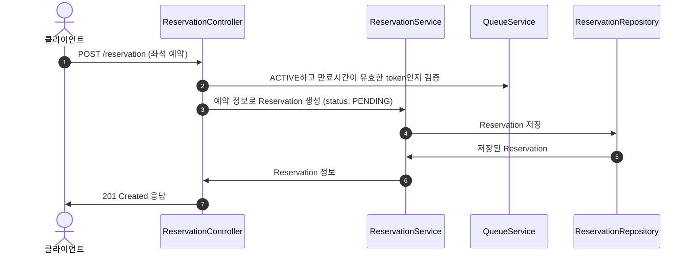
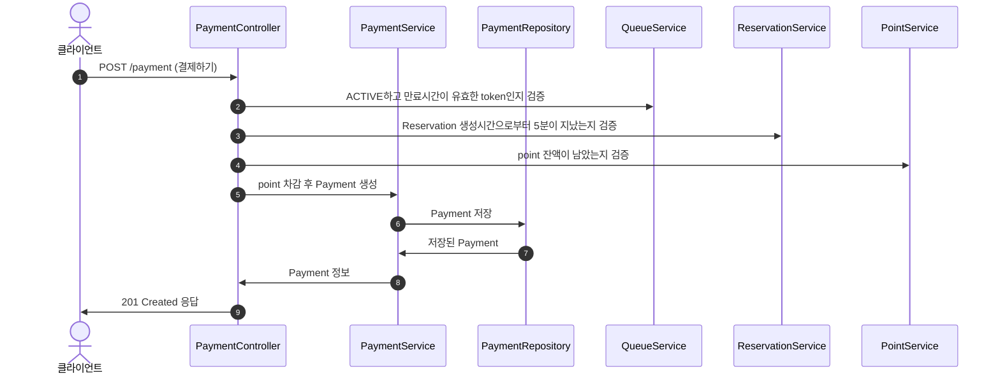

## 요구사항 
1. 대기열 토큰
   - 대기열 토큰을 발급한다.
   - 대기열 토큰을 조회한다.
2. 예약
   - 예약 가능한 날짜와 해당 날짜의 좌석을 조회한다.
   - 예약 가능한 날짜 목록을 조회한다.
   - 날짜 정보를 입력받아 예약가능한 좌석을 조회한다.
3. 좌석 예약
   - 날짜와 좌석 정보를 입력받아 좌석을 예약한다.
   - 좌석을 예약하면 5분간 임시 배정되고 시간 내 결제가 완료되지 않으면 임시 배정은 해제된다.
4. 포인트
   - 포인트를 충전한다.
   - 포인트를 조회한다.
5. 결제
   - 결제 내역을 조회한다.
   - 결제가 완료되면 좌석을 배정하고 대기열 토큰을 만료시킨다.

---

## ERD

---

## 시퀀스 다이어그램

### 토큰 발급

### 토큰 조회

### 좌석 예약

### 결제하기 

## 스웨거 
### 대기열 생성 

### 대기열 조회 

### 콘서트 예약 일정 조회

### 콘서트 좌석 조회

### 예약하기
