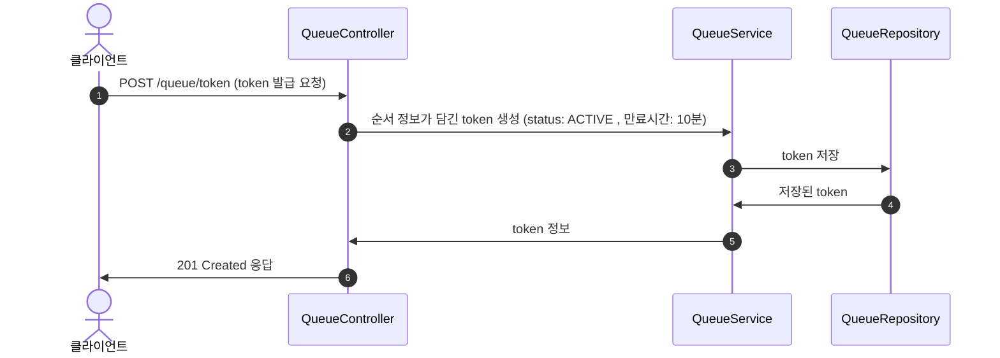
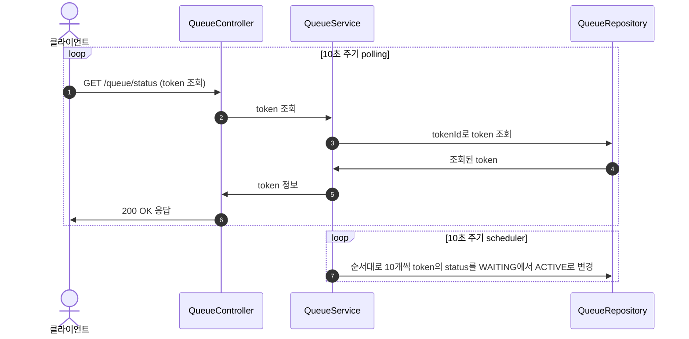
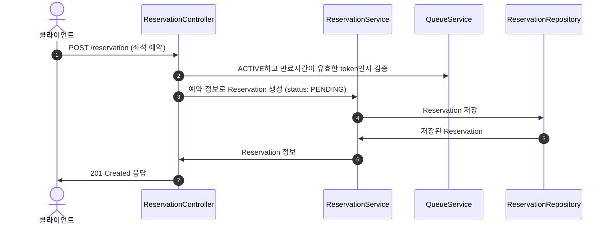
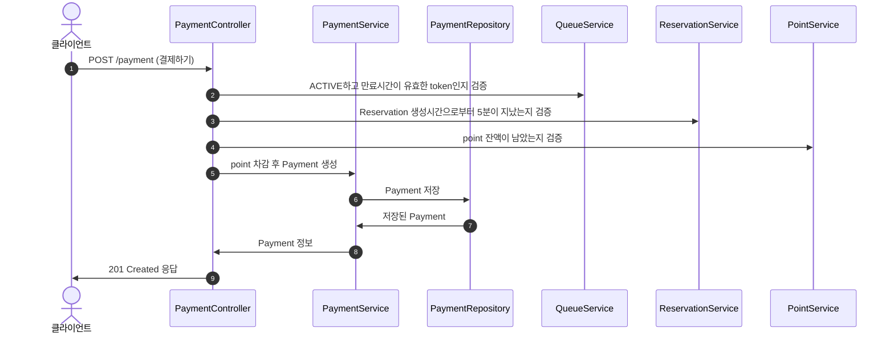

### 토큰 발급

```mermaid
sequenceDiagram
   autonumber
   actor User as 클라이언트
   
   participant QueueController
   participant QueueService 
   participant QueueRepository
   
   User ->> QueueController: POST /queue/token (token 발급 요청)
   QueueController ->> QueueService: 순서 정보가 담긴 token 생성 (status: ACTIVE , 만료시간: 10분)
   QueueService ->> QueueRepository: token 저장
   QueueRepository ->> QueueService: 저장된 token
   QueueService ->> QueueController: token 정보
   QueueController ->> User: 201 Created 응답
```

### 토큰 조회

```mermaid
sequenceDiagram
   autonumber
   actor User as 클라이언트
   participant QueueController
   participant QueueService
   participant QueueRepository
   loop 10초 주기 polling
       User ->> QueueController: GET /queue/status (token 조회)
       QueueController ->> QueueService: token 조회
       QueueService ->> QueueRepository: tokenId로 token 조회
       QueueRepository ->> QueueService: 조회된 token
       QueueService ->> QueueController: token 정보
       QueueController ->> User: 200 OK 응답
   end
   loop 10초 주기 scheduler
       QueueService ->> QueueRepository: 순서대로 10개씩 token의 status를 WAITING에서 ACTIVE로 변경 
   end
```

### 좌석 예약

```mermaid
sequenceDiagram
   autonumber
   actor User as 클라이언트
   participant ReservationController
   participant ReservationService
   participant QueueService
   participant ReservationRepository
   User ->> ReservationController: POST /reservation (좌석 예약)
   ReservationController ->> QueueService: ACTIVE하고 만료시간이 유효한 token인지 검증
   ReservationController ->> ReservationService: 예약 정보로 Reservation 생성 (status: PENDING)
   ReservationService ->> ReservationRepository: Reservation 저장
   ReservationRepository ->> ReservationService: 저장된 Reservation
   ReservationService ->> ReservationController: Reservation 정보
   ReservationController ->> User: 201 Created 응답
```

### 결제하기

```mermaid
sequenceDiagram
   autonumber
   actor User as 클라이언트
   participant PaymentController
   participant PaymentService
   participant PaymentRepository
   participant QueueService
   participant ReservationService
   participant PointService
   User ->> PaymentController: POST /payment (결제하기)
   PaymentController ->> QueueService: ACTIVE하고 만료시간이 유효한 token인지 검증 
   PaymentController ->> ReservationService: Reservation 생성시간으로부터 5분이 지났는지 검증 
   PaymentController ->> PointService: point 잔액이 남았는지 검증
   PaymentController ->> PaymentService: point 차감 후 Payment 생성
   PaymentService ->> PaymentRepository: Payment 저장
   PaymentRepository ->> PaymentService: 저장된 Payment
   PaymentService ->> PaymentController: Payment 정보
   PaymentController ->> User: 201 Created 응답
```